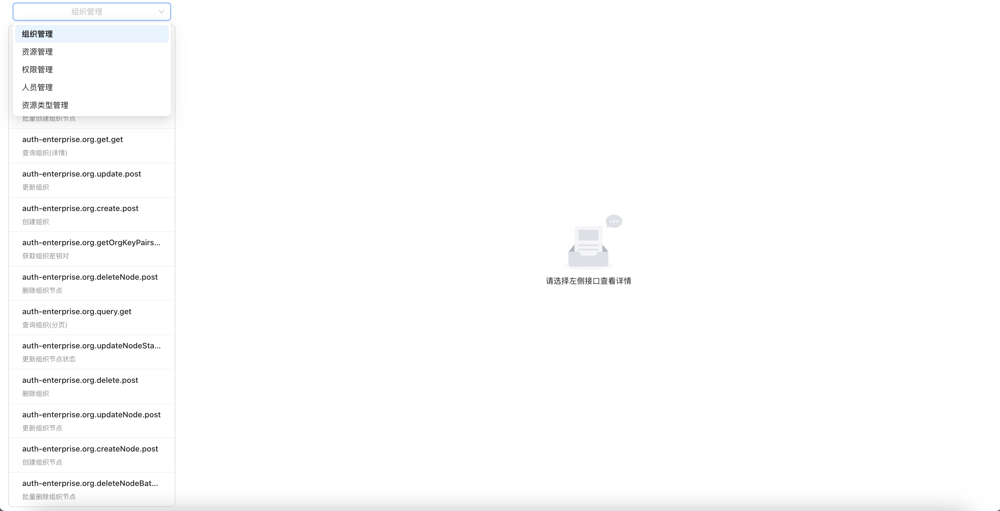
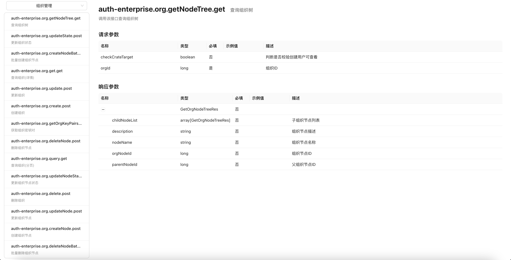
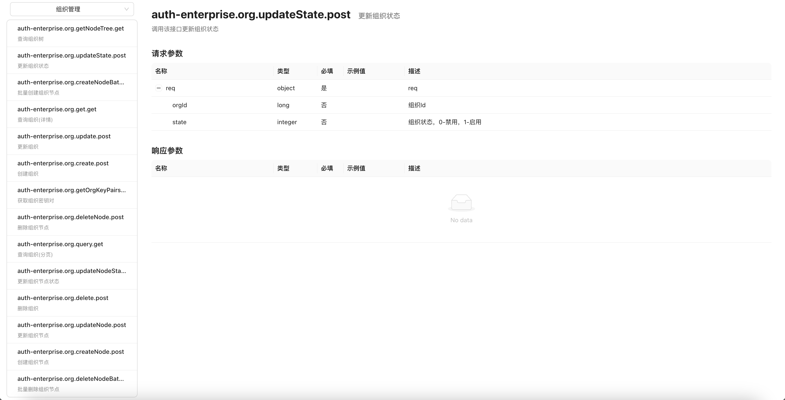

# OpenAPI to APISchema

一个基于JDK1.8开发的OpenAPI文档转换工具


<br>

## 项目介绍

OpenAPI to APISchema 是一个基于JDK1.8开发的OpenAPI文档转换工具。目前支持将符合OpenAPI2.0（原swagger2.0）、3.0规范的文档，转换成自定义的结构化格式`ApiSchema`。  

该工具主要运用在企业级的开放平台API文档中，可用于前端组件展示或后端对Api进行结构校验或调用时进行属性赋值。

<br>

## 快速开始

1. 添加Maven依赖，建议使用最新的release版本

```xml
<dependency>
    <groupId>com.github.brotherc</groupId>
    <artifactId>openapi2apischema-core</artifactId>
    <version>1.0.0</version>
</dependency>
```

2. 使用下面的Java代码，并替换为实际的OpenAPI接口文档地址，代码最终会输出解析OpenAPI文档得到的所有接口信息  

```java
import com.fasterxml.jackson.databind.ObjectMapper;
import com.github.openapi2apischema.core.ApiSchemaGenerator;
import com.github.openapi2apischema.core.enums.OpenApiVersion;
import com.github.openapi2apischema.core.model.ApiSchema;

import java.io.IOException;
import java.util.Arrays;
import java.util.List;

public class TestMain {

  // 替换为实际的swagger2.0接口地址
  private static final List<String> swaggerUrl = Arrays.asList(
          "http://xxx/v2/api-docs"
  );

  // 替换为实际的swagger3.0接口地址
  private static final List<String> swaggerUrlV3 = Arrays.asList(
          "http://xxx/v3/api-docs"
  );

  public static void main(String[] args) throws IOException {
    for (String url : swaggerUrl) {
      List<ApiSchema> apiSchemas = ApiSchemaGenerator.generateBySwaggerUrl(OpenApiVersion.V2, url, null);
      System.out.println(new ObjectMapper().writeValueAsString(apiSchemas));
    }
    for (String url : swaggerUrlV3) {
      List<ApiSchema> apiSchemas = ApiSchemaGenerator.generateBySwaggerUrl(OpenApiVersion.V3, url, null);
      System.out.println(new ObjectMapper().writeValueAsString(apiSchemas));
    }
  }

}
```

<br>

## 示例
### 后端
如果需要在springboot项目中使用，并结合前端组件进行展示，可以参考下面代码。用户同样需要先将`init()`方法中的OpenAPI接口文档地址替换为实际地址，接着启动应用。  

应用会在启动过程中调用通过`ApiSchemaGenerator`解析出OpenAPI文档中的接口信息，并转换为`ApiSchema`，最终按tag分租保存在Map中。完整的后端工程代码示例，请查看[openapi2apischema-demo](openapi2apischema-demo)

```java
import com.github.openapi2apischema.core.ApiSchemaGenerator;
import com.github.openapi2apischema.core.enums.OpenApiVersion;
import com.github.openapi2apischema.core.model.ApiSchema;
import org.springframework.util.CollectionUtils;
import org.springframework.web.bind.annotation.GetMapping;
import org.springframework.web.bind.annotation.RequestMapping;
import org.springframework.web.bind.annotation.RequestParam;
import org.springframework.web.bind.annotation.RestController;

import javax.annotation.PostConstruct;
import java.io.IOException;
import java.util.*;
import java.util.stream.Collectors;

@RestController
@RequestMapping("/apiSchema")
public class ApiSchemaController {

    private Map<String, List<ApiSchema>> apiMapping;

    @PostConstruct
    public void init() throws IOException {
        // 替换为实际的swagger2.0接口地址
        List<ApiSchema> apiSchemas = ApiSchemaGenerator.generateBySwaggerUrl(OpenApiVersion.V2, "https://xxx/v2/api-docs", null);
        // 替换为实际的swagger3.0接口地址
        // List<ApiSchema> apiSchemas = ApiSchemaGenerator.generateBySwaggerUrl(OpenApiVersion.V3, "https://xxx/v3/api-docs", null);
        if (!CollectionUtils.isEmpty(apiSchemas)) {
            apiMapping = apiSchemas.stream().collect(Collectors.groupingBy(o -> o.getTags().get(0)));
        } else {
            apiMapping = new HashMap<>();
        }
    }

    /**
     * 获取OpenAPI文档中所有的tag
     */
    @GetMapping("/tags")
    public List<Map<String, Object>> getTags() {
        return apiMapping.keySet().stream().map(o -> {
            Map<String, Object> map = new HashMap<>();
            map.put("value", o);
            map.put("label", o);
            return map;
        }).collect(Collectors.toList());
    }

    /**
     * 获取tag对应的所有接口，仅包括名称和中文名称
     */
    @GetMapping("/apiListByTag")
    public List<Map<String, Object>> getApiListByTag(@RequestParam String tag) {
        return apiMapping.get(tag).stream().map(o -> {
            Map<String, Object> map = new HashMap<>();
            map.put("title", o.getName());
            map.put("subTitle", o.getCnName());
            map.put("code", o.getCode());
            return map;
        }).collect(Collectors.toList());
    }

    /**
     * 根据tag和code获取ApiSchema
     */
    @GetMapping("/apiAchemaByCode")
    public ApiSchema getApiAchemaByCode(@RequestParam String tag, @RequestParam String code) {
        return Optional.ofNullable(apiMapping.get(tag))
                .map(list -> list.stream().filter(o -> o.getCode().equals(code)).findFirst())
                .map(Optional::get)
                .orElse(null);
    }

}
```
### 前端
前端代码此处省略，完整工程请查看[web](openapi2apischema-demo/src/main/resources/web)，前端工程可通过`npm run dev`启动，访问http://localhost:3000

### 运行效果
  
  
  


<br>

## 致谢

以下开源项目对本项目的开发提供了帮助或启发，谨致谢意：

- **[swagger-parser](https://github.com/swagger-api/swagger-parser)**  
  用于解析 Swagger/OpenAPI 规范，支撑接口结构提取功能